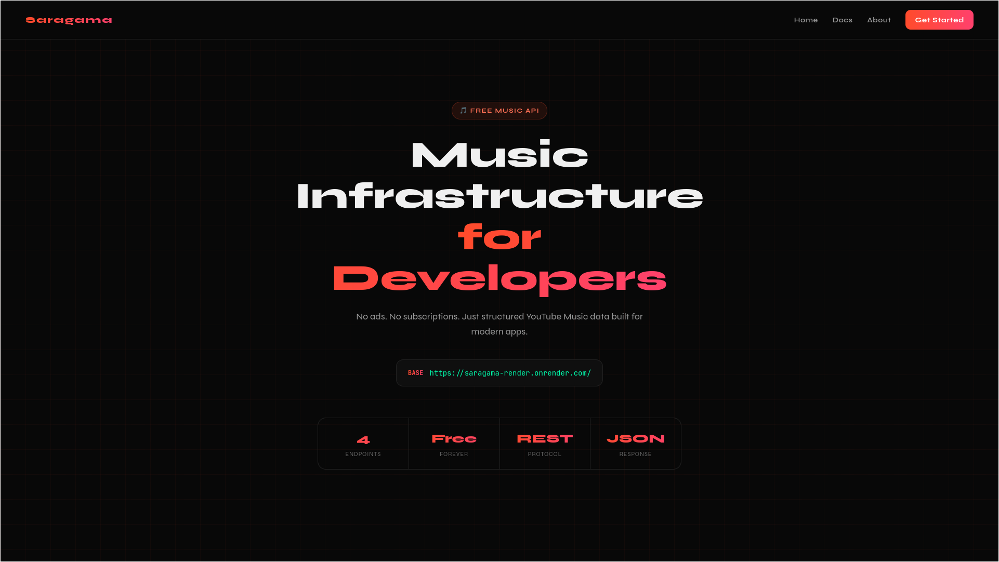
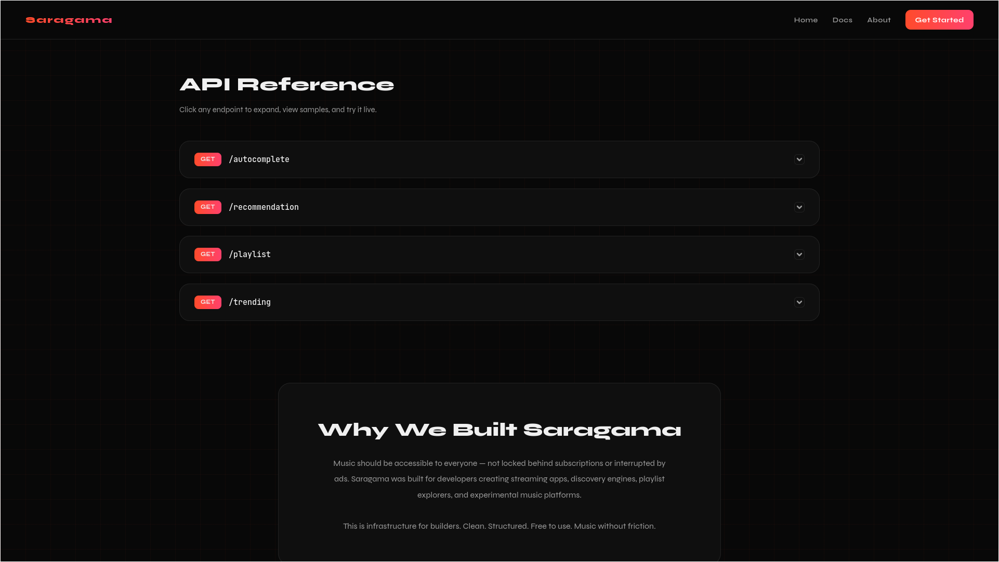

# 🎵 Saragama API

> **Music Infrastructure for Developers**

A free, open music API built on top of YouTube Music — designed for developers building streaming apps, discovery engines, playlist explorers, and experimental music platforms. Clean. Structured. No subscriptions. No ads.

🔗 **Live API:** [https://saragama-render.onrender.com](https://saragama-render.onrender.com)

---

## 📸 Screenshots

**Home**


**API Reference / Docs**


---

## ✨ Features

- 🔍 **Song Search / Autocomplete** — Search songs with metadata including artist, thumbnail, and duration
- 🎧 **Recommendations** — Get related tracks based on any YouTube Music video ID
- 📋 **Playlist Fetcher** — Fetch full playlist data by playlist ID
- 📈 **Trending Charts** — Get daily, weekly trending songs and top artists in India

---

## 🚀 Getting Started

### Prerequisites

- Python 3.11+
- pip

### Installation

```bash
# Clone the repository
git clone https://github.com/your-username/SaraGama-API.git
cd SaraGama-API

# Install dependencies
pip install -r requirements.txt

# Run the server
python main.py
```

The server starts at `http://localhost:8000` by default. You can override the port via the `PORT` environment variable.

---

## 🐳 Docker

```bash
# Build the image
docker build -t saragama-api .

# Run the container
docker run -p 8000:8000 saragama-api
```

---

## 📡 API Endpoints

### Base URL

```
https://saragama-render.onrender.com
```

---

### `GET /`

Returns the interactive API documentation page.

---

### `GET /autocomplete`

Search for songs by query string.

**Query Parameters**

| Parameter | Type   | Required | Description        |
|-----------|--------|----------|--------------------|
| `q`       | string | ✅ Yes   | Search query text  |

**Example Request**
```
GET /autocomplete?q=Kesariya
```

**Example Response**
```json
[
  {
    "title": "Kesariya",
    "video_url": "BddP6PYo2gs",
    "artist": ["Arijit Singh"],
    "thumbnail": "https://...",
    "duration": "4:34"
  }
]
```

---

### `GET /recommendation`

Get up to 10 recommended tracks based on a YouTube Music video ID.

**Query Parameters**

| Parameter  | Type   | Required | Description              |
|------------|--------|----------|--------------------------|
| `video_id` | string | ✅ Yes   | YouTube Music video ID   |

**Example Request**
```
GET /recommendation?video_id=BddP6PYo2gs
```

**Example Response**
```json
[
  {
    "video_id": "abc123",
    "title": "Tum Hi Ho",
    "artist": "Arijit Singh",
    "artist_id": "xyz",
    "album": "Aashiqui 2",
    "duration": "4:22",
    "thumbnail": "https://..."
  }
]
```

---

### `GET /playlist`

Fetch a YouTube Music playlist by its playlist ID.

**Query Parameters**

| Parameter | Type   | Required | Description          |
|-----------|--------|----------|----------------------|
| `playid`  | string | ✅ Yes   | YouTube playlist ID  |

**Example Request**
```
GET /playlist?playid=PLx0sYbCqOb8TBPRdmBHs5Iftvv9TPboYG
```

**Example Response**
```json
{
  "title": "Top Hits",
  "trackCount": 50,
  "tracks": [ ... ]
}
```

> Returns an empty array `[]` if the playlist ID is invalid.

---

### `GET /trending`

Get current trending music charts in India — includes daily picks, weekly charts, and top artists.

**No parameters required.**

**Example Request**
```
GET /trending
```

**Example Response**
```json
{
  "daily": [{ "title": "Trending 20 India" }],
  "weekly": [{ "title": "Top Weekly Videos Punjabi" }],
  "artists": [{ "title": "Alka Yagnik", "rank": "1" }]
}
```

---

## 🗂️ Project Structure

```
SaraGama-API/
├── main.py            # FastAPI app, route definitions
├── yt_engine.py       # Core YouTube Music logic (search, recommendations)
├── models.py          # Pydantic models
├── requirements.txt   # Python dependencies
├── Dockerfile         # Docker configuration
├── nixpacks.toml      # Nixpacks deploy configuration (Railway etc.)
└── templates/
    └── index.html     # Interactive API docs landing page
```

---

## 🛠️ Tech Stack

| Layer       | Technology                  |
|-------------|-----------------------------|
| Framework   | FastAPI                     |
| Server      | Uvicorn                     |
| Music Data  | ytmusicapi (YouTube Music)  |
| Templating  | Jinja2                      |
| Container   | Docker                      |

---

## 📦 Dependencies

```
fastapi
uvicorn
python-dotenv
ytmusicapi
Jinja2
python-multipart
```

---

## 🌐 Deployment

This project is deployed on **Render** and configured for platforms that support Nixpacks (like Railway) via `nixpacks.toml`.

The `PORT` environment variable is respected automatically:

```python
port = int(os.environ.get("PORT", 8000))
```

---

## 📄 License

This project is open-source and free to use. Built for developers, by developers.

---

> © 2026 **Saragama** · Music for Everyone · Built for Developers
